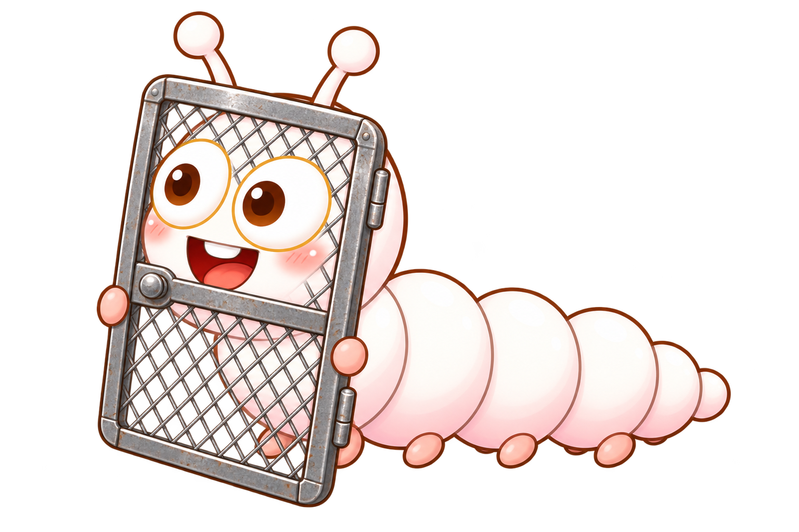
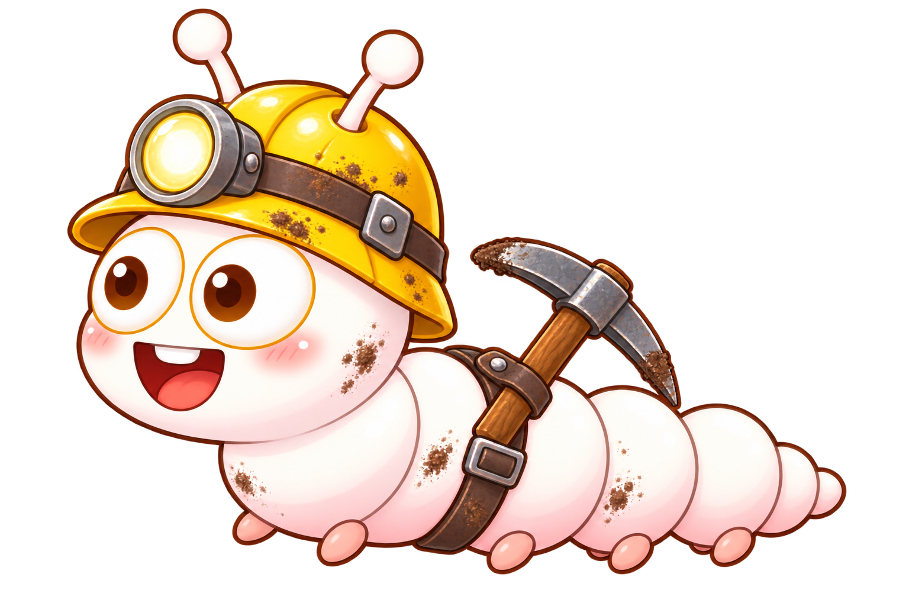
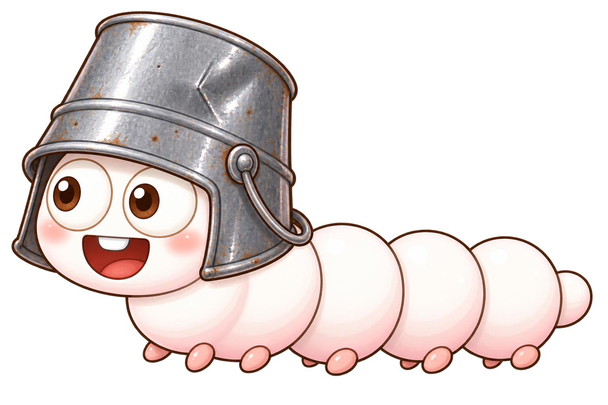

# 枝江图鉴

> 本文件是我方单位与敌方单位的可编辑设计稿。当前内容对应游戏现状；后续修改本文件后，可以要求 Codex 将属性、机制、文案、顺序与视觉资源同步回游戏。

## 同步约定

- `id` 是代码使用的稳定标识。修改名称时通常不要修改 `id`；新增单位时必须使用新的、仅含小写英文字母、数字和下划线的 `id`。
- YAML 数据块中的值是同步时的权威数据。标题和图片只用于阅读，不覆盖数据块。
- 时间统一使用毫秒（`*_ms`），距离与范围统一使用像素（`*_px`），概率与倍率使用小数。
- `null` 表示无此机制；空字符串 `""` 表示当前没有文案。需要移除可选机制时，请写 `null`，不要只删除字段。
- `codex_desc` 是游戏图鉴和卡片使用的短文案；`quote` 是敌方图鉴引语；`lore` 是预留的扩展设定。填写 `lore` 后，同步时需要相应扩展游戏图鉴展示。
- `mechanics` 记录真实战斗行为，包含目前散落在行为代码中的参数。修改这些值时，应同时同步数据配置、行为实现和图鉴文案。
- `visual.asset` 为 `generated` 时，表示该形象由游戏代码程序化绘制；填写图片路径后，同步时可改为外部贴图。
- 若自然语言描述与明确数值冲突，同步时优先采用明确数值，并在提交修改前指出冲突。

```yaml
schema_version: 1
last_synced: "2026-08-30"
ally_order:
  - beijixing
  - jiaxintang
  - naiqilin
  - xiaohainuo
  - xinqiuyi
  - bella
  - eileen
  - diana
  - gladys
  - fiona
  - xingkongtang
  - xilanai
  - jiaxinnaitang
  - yigehun
enemy_order:
  - basic
  - cone
  - phone
  - flag
  - screen
  - balloon
  - ladder
  - football
  - sled
  - miner
  - bucket
  - pole
  - knight
  - dragon
  - carol
level_order:
  - 1
  - 2
  - 3
  - 4
  - 5
  - 6
  - 7
  - 8
  - 9
  - 10
```

## 字段单位

| 字段 | 含义 |
| --- | --- |
| `cost` | 放置消耗的应援值 |
| `cooldown_ms` | 卡片再次可用前的冷却时间 |
| `hp` | 生命值 |
| `attack_interval_ms` | 两次攻击之间的基础间隔 |
| `damage` | 单次直接伤害 |
| `speed` | 敌方基础移动速度，单位为像素/秒；实际蠕动会附加周期步幅系数 |
| `attack_dps` | 敌方啃食造成的每秒伤害 |
| `accent` | 图鉴卡片和 UI 使用的十六进制主题色 |

## 我方阵容

### 01 · 贝极星


```yaml
id: beijixing
name: 贝极星
role: 应援补给
cost: 50
cooldown_ms: 6500
hp: 1000
behavior: producer
accent: "#63d9ff"
codex_desc: 每 9 秒产生 25 点应援
lore: ""
visual:
  texture_key: plant_beijixing
  asset: images/fans-beijixing-v2.png
  normalized_size: [86, 88]
mechanics:
  produce_interval_ms: 9000
  produce_amount: 25
```

### 02 · 嘉心糖


```yaml
id: jiaxintang
name: 嘉心糖
role: 糖果射手
cost: 100
cooldown_ms: 6500
hp: 300
behavior: shooter
accent: "#ff7fab"
codex_desc: 发射糖果炮弹攻击本行
lore: ""
visual:
  texture_key: plant_jiaxintang
  asset: images/fans-jiaxintang-v2.png
  normalized_size: [82, 94]
mechanics:
  attack_interval_ms: 1350
  damage: 22
  projectile: projectile_candy
  projectile_speed_px_per_second: 390
```

### 03 · 奶淇琳


```yaml
id: naiqilin
name: 奶淇琳
role: 甜点投手
cost: 125
cooldown_ms: 8500
hp: 300
behavior: lobber
accent: "#d8b3ff"
codex_desc: 投巧克力；25% 奶油定身
lore: ""
visual:
  texture_key: plant_naiqilin
  asset: images/fans-naiqilin-v2.png
  normalized_size: [84, 94]
mechanics:
  attack_interval_ms: 2100
  damage: 34
  projectile: projectile_chocolate
  projectile_speed_px_per_second: 390
  lobbed: true
  splash_radius_px: 35
  splash_damage_ratio: 0.45
  cream_chance: 0.25
  cream_stun_ms: 1200
```

### 04 · 小海诺


```yaml
id: xiaohainuo
name: 小海诺
role: 舞台屏障
cost: 75
cooldown_ms: 15000
hp: 2500
behavior: wall
accent: "#50d7ce"
codex_desc: 以高耐久抵挡 A87
lore: ""
visual:
  texture_key: plant_xiaohainuo
  asset: images/xiaohainuo-v2.png
  normalized_size: [78, 94]
mechanics:
  can_attack: false
```

### 05 · 心球仪


```yaml
id: xinqiuyi
name: 心球仪
role: 共鸣爆破
cost: 150
cooldown_ms: 24000
hp: 999
behavior: bomb
accent: "#ff5a91"
codex_desc: 短暂蓄力后造成范围爆炸
lore: ""
visual:
  texture_key: plant_xinqiuyi
  asset: images/xinqiuyi-v2.png
  normalized_size: [78, 94]
mechanics:
  fuse_ms: 520
  damage: 1500
  radius_px: 142
  stun_ms: 350
  consumed_on_detonation: true
```

### 06 · 贝拉


```yaml
id: bella
name: 贝拉
role: 锤击变阵
cost: 150
cooldown_ms: 12000
hp: 1000
behavior: bella
accent: "#e54955"
codex_desc: 远投锤子；近敌时化为地雷
lore: ""
visual:
  texture_key: plant_bella
  asset: images/idol-bella-v2.png
  normalized_size: [78, 94]
mechanics:
  ranged_attack_interval_ms: 2700
  ranged_damage: 92
  ranged_projectile: projectile_hammer
  projectile_speed_px_per_second: 390
  ranged_lobbed: true
  ranged_splash_radius_px: 42
  splash_damage_ratio: 0.45
  transform_distance_px: 88
  mine_trigger_distance_px: 48
  mine_damage: 1050
  mine_radius_px: 100
  mine_stun_ms: 300
  consumed_on_detonation: true
```

### 07 · 乃琳


```yaml
id: eileen
name: 乃琳
role: 穿透变阵
cost: 150
cooldown_ms: 11000
hp: 300
behavior: eileen
accent: "#9b72e8"
codex_desc: 远程穿透；近敌时化为地刺
lore: ""
visual:
  texture_key: plant_eileen
  asset: images/idol-eileen-v2.png
  normalized_size: [78, 94]
mechanics:
  ranged_attack_interval_ms: 1900
  ranged_damage: 32
  ranged_projectile: projectile_beam
  projectile_speed_px_per_second: 390
  ranged_piercing: true
  transform_distance_px: 88
  spike_attack_interval_ms: 850
  spike_damage: 26
  spike_stun_ms: 520
```

### 08 · 嘉然


```yaml
id: diana
name: 嘉然
role: 距离机枪
cost: 200
cooldown_ms: 12000
hp: 300
behavior: rapid
accent: "#ff9b55"
codex_desc: 敌人越近攻速越快，一格内提升至 5 倍
lore: ""
visual:
  texture_key: plant_diana
  asset: images/idol-diana-v2.png
  normalized_size: [78, 94]
mechanics:
  damage: 16
  projectile: projectile_candy
  projectile_speed_px_per_second: 390
  base_attack_interval_ms: 950
  nearest_attack_interval_ms: 190
  nearest_distance_px: 88
  farthest_distance_px: 704
  speed_multiplier_range: [1, 5]
  multiplier_interpolation: linear
```

### 09 · 思诺


```yaml
id: gladys
name: 思诺
role: 全场冰冻
cost: 250
cooldown_ms: 13000
hp: 300
behavior: freeze
accent: "#54c8ff"
codex_desc: 冰冻全场；概率留下心宜或小海诺
lore: ""
visual:
  texture_key: plant_gladys
  asset: images/idol-gladys-v2.png
  normalized_size: [78, 94]
mechanics:
  fuse_ms: 520
  freeze_all_enemies: true
  freeze_duration_ms: 4000
  consumed_after_freeze: true
  replacement_chances:
    fiona: 0.20
    xiaohainuo: 0.20
    none: 0.60
```

### 10 · 心宜


```yaml
id: fiona
name: 心宜
role: 概率支援
cost: 250
cooldown_ms: 22000
hp: 300
behavior: squash
accent: "#ff6fba"
codex_desc: 压扁敌人；概率留下思诺或心球仪
lore: ""
visual:
  texture_key: plant_fiona
  asset: images/idol-fiona-v2.png
  normalized_size: [78, 94]
mechanics:
  trigger_distance_px: 165
  leap_duration_ms: 300
  damage: 1200
  consumed_after_attack: true
  replacement_chances:
    gladys: 0.20
    xinqiuyi: 0.20
    none: 0.60
```

### 11 · 星空糖（融合）


```yaml
id: xingkongtang
name: 星空糖
role: 星糖融合射手
fusion_materials:
  - beijixing
  - jiaxintang
fusion_order_independent: true
cost: 0
cooldown_ms: 0
hp: 1000
behavior: lifesteal
accent: "#ffd44f"
codex_desc: 吸血星糖射击；30% 概率造成 3 倍暴击
lore: ""
visual:
  texture_key: plant_xingkongtang
  asset: images/plant-xingkongtang-v1.png
  normalized_size: [78, 94]
mechanics:
  attack_interval_ms: 1000
  damage: 30
  projectile: projectile_star_candy
  lifesteal_ratio: 0.50
  critical_chance: 0.30
  critical_damage_multiplier: 3
  synergy_requires:
    - bella
    - diana
  synergy_hp_multiplier: 2
  synergy_attack_interval_ms: 500
  synergy_lifesteal_ratio: 1.00
```

### 12 · 喜拉乃（融合）


```yaml
id: xilanai
name: 喜拉乃
role: 星巧融合投手
fusion_materials:
  - beijixing
  - naiqilin
fusion_order_independent: true
cost: 0
cooldown_ms: 0
hp: 1000
behavior: sunlobber
accent: "#f4c25e"
codex_desc: 产阳光并投掷星形巧克力，概率召唤特殊贝极星
lore: ""
visual:
  texture_key: plant_xilanai
  asset: images/plant-xilanai-v1.png
  normalized_size: [78, 94]
mechanics:
  produce_interval_ms: 20000
  produce_amount: 50
  attack_interval_ms: 2100
  damage: 40
  projectile: projectile_star_candy
  lobbed: true
  special_beijixing_chance: 0.15
  synergy_requires:
    - bella
    - eileen
  synergy_special_beijixing_chance: 0.30
  special_beijixing:
    deploy_at_hit_enemy_cell: true
    requires_empty_deployable_cell: true
    hits_before_destroyed: 3
    incoming_attack_to_sun_ratio: 0.30
```

### 13 · 嘉心奶糖（融合）


```yaml
id: jiaxinnaitang
name: 嘉心奶糖
role: 八向爆糖投手
fusion_materials:
  - naiqilin
  - jiaxintang
fusion_order_independent: true
cost: 0
cooldown_ms: 0
hp: 300
behavior: burstlobber
accent: "#ffa6bc"
codex_desc: 冰淇淋主弹炸开后发射 8 枚八向糖果子弹
lore: ""
visual:
  texture_key: plant_jiaxinnaitang
  asset: images/plant-jiaxinnaitang-v1.png
  normalized_size: [78, 94]
mechanics:
  attack_interval_ms: 2000
  damage: 40
  projectile: projectile_candy_ice_cream
  lobbed: true
  burst_projectile_count: 8
  burst_projectile_damage: 30
  burst_directions_evenly_spaced_degrees: 45
  synergy_requires:
    - eileen
    - diana
  synergy_critical_chance: 0.30
  synergy_critical_damage_multiplier: 1.50
  critical_replaces_burst_with_ice_cream_projectiles: true
  critical_burst_secondary_explosion_radius_px: 58
  critical_burst_secondary_explosion_damage: 30
```

### 14 · 一个魂（三重融合）


```yaml
id: yigehun
name: 一个魂
role: 三重削弱射手
fusion_materials:
  - beijixing
  - naiqilin
  - jiaxintang
fusion_paths:
  - [xingkongtang, naiqilin]
  - [xilanai, jiaxintang]
  - [jiaxinnaitang, beijixing]
cost: 0
cooldown_ms: 0
hp: 1500
behavior: soulshooter
accent: "#b594ff"
codex_desc: 灵魂弹叠加减速与攻击下降，最多 3 层
lore: ""
visual:
  texture_key: plant_yigehun
  asset: images/plant-yigehun-v1.png
  normalized_size: [82, 98]
mechanics:
  attack_interval_ms: 1500
  damage: 20
  projectile: projectile_soul_candy
  debuff_duration_ms: 3000
  debuff_max_stacks: 3
  speed_multiplier_per_stack: 0.50
  attack_multiplier_per_stack: 0.70
  stacking_mode: multiplicative
  three_stack_speed_multiplier: 0.125
  three_stack_attack_multiplier: 0.343
  bonus_copy_synergy_requires:
    - bella
    - eileen
    - diana
  bonus_copy_on_each_fusion: 1
  bonus_copy_cost: 0
  bonus_copy_is_directly_deployable: true
```

## 敌方档案

所有敌人均采用软体虫蠕动：配置中的 `speed` 会乘以周期变化的 `0.68–1.26` 步幅系数。冲锋、减速等效果在此基础上继续叠乘。

### E-01 · A87


```yaml
id: basic
name: A87
quote: A8 最常见的生物，它们只懂得蠕动
lore: ""
hp: 240
speed: 12
attack_dps: 48
visual:
  texture_key: zombie_basic
  asset: images/a87-base-v2.png
  normalized_size: [120, 86]
  scale: 1.0
mechanics:
  boss: false
  can_vault: false
  charge: false
  summon_interval_ms: null
```

### E-02 · 路障 A87


```yaml
id: cone
name: 路障 A87
quote: 它们学会了将曾经的阻碍戴在头上
lore: ""
hp: 480
speed: 11
attack_dps: 50
visual:
  texture_key: zombie_cone
  asset: images/a87-cone-v3.png
  normalized_size: [126, 104]
  break_texture_key: zombie_basic
mechanics:
  armor_break_hp: 240
  becomes_basic_after_armor_break: true
```

### E-03 · 刷手机 A87


```yaml
id: phone
name: 刷手机 A87
quote: 它们从不错过任何一个热点
lore: ""
hp: 480
speed: 10
attack_dps: 48
visual:
  texture_key: zombie_phone
  asset: images/a87-phone-v3.png
  normalized_size: [126, 96]
  break_texture_key: zombie_basic
mechanics:
  phone_break_hp: 240
  speed_multiplier_after_phone_lost: 2.5
  flying: false
  flag_wave: false
```

### E-04 · 旗子 A87


```yaml
id: flag
name: 旗子 A87
quote: 它们号召大家发起冲锋，但自己走的却很慢
lore: ""
hp: 240
speed: 7.5
attack_dps: 45
visual:
  texture_key: zombie_flag
  asset: images/a87-flag-v3.png
  normalized_size: [140, 112]
mechanics:
  flag_wave: true
  auto_spawn_before_huge_wave_ms: 650
  flying: false
```

### E-05 · 铁门网 A87



```yaml
id: screen
name: 铁门网 A87
quote: 这是骑士的盾牌
lore: ""
hp: 1080
speed: 9
attack_dps: 52
visual:
  texture_key: zombie_screen
  asset: images/a87-screen-v3.png
  normalized_size: [132, 100]
  break_texture_key: zombie_basic
mechanics:
  screen_break_hp: 240
  flying: false
```

### E-06 · 气球 A87


```yaml
id: balloon
name: 气球 A87
quote: A8 区能飞
lore: ""
hp: 360
speed: 11
attack_dps: 52
visual:
  texture_key: zombie_balloon
  asset: images/a87-balloon-v3.png
  normalized_size: [104, 130]
mechanics:
  flying: true
  ignores_plant_blocking: true
```

### E-07 · 梯子 A87


```yaml
id: ladder
name: 梯子 A87
quote: 它们学会了绕过障碍
lore: ""
hp: 720
speed: 16
attack_dps: 55
visual:
  texture_key: zombie_ladder
  asset: images/a87-ladder-v3.png
  normalized_size: [142, 104]
  break_texture_key: zombie_basic
mechanics:
  bypass_first_plant: true
  bypass_height_px: 28
  bypass_duration_ms: 520
  speed_multiplier_after_ladder_lost: 0.62
```

### E-08 · 橄榄球 A87


```yaml
id: football
name: 橄榄球 A87
quote: 它们不知道什么是橄榄球，但这副装备确实让它们蠕动得更快
lore: ""
hp: 1100
speed: 19
attack_dps: 82
visual:
  texture_key: zombie_football
  asset: images/a87-football-v3.png
  normalized_size: [140, 104]
mechanics:
  charge: true
  charge_speed_multiplier: 1.45
  charge_ends_on_first_contact: true
```

### E-09 · 雪橇车 A87


```yaml
id: sled
name: 雪橇车 A87
quote: 起猛了，区也会开车？
lore: ""
hp: 1800
speed: 14
attack_dps: 120
visual:
  texture_key: zombie_sled
  asset: images/a87-sled-v3.png
  normalized_size: [160, 108]
mechanics:
  crushes_plants_on_contact: true
  stops_to_eat: false
```

### E-10 · 矿工 A87



```yaml
id: miner
name: 矿工 A87
quote: 它们从地下绕到了防线背后
lore: ""
hp: 620
speed: 13
attack_dps: 58
visual:
  texture_key: zombie_miner
  asset: images/a87-miner-v3.png
  normalized_size: [132, 104]
mechanics:
  tunnels_past_front_defense: true
  surfaces_left_of_first_column: true
  moves_right_after_surfacing: true
```

### E-11 · 铁桶 A87



```yaml
id: bucket
name: 铁桶 A87
quote: 它们有了更坚固的防具
lore: ""
hp: 720
speed: 10
attack_dps: 55
visual:
  texture_key: zombie_bucket
  asset: images/a87-bucket-v2.png
  normalized_size: [126, 96]
  scale: 1.0
mechanics:
  boss: false
  can_vault: false
  charge: false
  summon_interval_ms: null
```

### E-12 · 撑杆跳 A87


```yaml
id: pole
name: 撑杆跳 A87
quote: 跳过去
lore: ""
hp: 340
speed: 15
attack_dps: 46
visual:
  texture_key: zombie_pole
  asset: images/a87-pole-v2.png
  normalized_size: [142, 100]
  scale: 1.0
mechanics:
  boss: false
  can_vault: true
  vault_once: true
  vault_duration_ms: 520
  vault_height_px: 62
  landing_offset_px: 78
  charge: false
  summon_interval_ms: null
```

### E-13 · 皇家骑士（黑化）

> 当前形象由游戏代码程序化绘制。

```yaml
id: knight
name: 皇家骑士（黑化）
quote: 它们什么也不懂，只懂得冲锋
lore: ""
hp: 980
speed: 17
attack_dps: 90
visual:
  texture_key: zombie_knight
  asset: generated
  normalized_size: [80, 100]
  scale: 1.0
mechanics:
  boss: false
  can_vault: false
  charge: true
  charge_speed_multiplier: 1.45
  charge_ends_on_first_contact: true
  summon_interval_ms: null
```

### E-14 · 神区化龙 A87


```yaml
id: dragon
name: 神区化龙 A87
quote: 白虫化龙，妄图夺走枝江舞台
lore: ""
hp: 3200
speed: 6.5
attack_dps: 85
visual:
  texture_key: zombie_dragon
  asset: images/a87-dragon-v2.png
  normalized_size: [178, 124]
  scale: 1.06
mechanics:
  boss: true
  can_vault: false
  charge: false
  summon_interval_ms: null
```

### E-15 · 珈乐（黑化）


```yaml
id: carol
name: 珈乐（黑化）
quote: 往日种种，你难道都忘了吗
lore: ""
hp: 4200
speed: 5.5
attack_dps: 78
visual:
  texture_key: zombie_carol
  asset: images/carol-corrupted-v2.png
  normalized_size: [104, 118]
  scale: 1.0
mechanics:
  boss: true
  can_vault: false
  charge: false
  summon_type: knight
  summon_interval_ms: 11000
  summon_same_row: true
  summon_offset_px: 36
```


## 关卡配置

关卡采用数据驱动配置，精确波次、每组数量与刷怪间隔位于 `src/data/levels.ts`。推进规则为：首次进入仅开放第 1 关；通关后在浏览器本地记录进度，解锁下一关与一张新角色卡；失败不会回退进度。

| 关卡 | 名称 | 初始应援 | 可用卡 | 主要敌人 | 波数 | 通关奖励 |
| --- | --- | ---: | ---: | --- | ---: | --- |
| 01 | 初遇白虫 | 200 | 2 | A87、旗子 | 3 | 奶淇琳 |
| 02 | 热点追踪 | 200 | 3 | A87、路障、刷手机、旗子 | 4 | 小海诺 |
| 03 | 铁门骑士 | 225 | 4 | A87、刷手机、铁门网、旗子 | 4 | 心球仪 |
| 04 | 梯子入场 | 225 | 5 | A87、铁门网、梯子、旗子 | 5 | 贝拉 |
| 05 | A8 区能飞 | 250 | 6 | A87、刷手机、铁门网、气球、旗子 | 5 | 乃琳 |
| 06 | 黑化骑士 | 250 | 7 | A87、撑杆、橄榄球、皇家骑士 | 5 | 嘉然 |
| 07 | 混编突袭 | 275 | 8 | 铁门网、梯子、橄榄球、雪橇车、旗子 | 6 | 思诺 |
| 08 | 龙骑共舞 | 275 | 9 | 气球、矿工、雪橇车、化龙、旗子 | 6 | 心宜 |
| 09 | 终演预热 | 300 | 10 | 橄榄球、雪橇车、矿工、梯子、化龙 | 6 | 最终幕 |
| 10 | 舞台决战 | 325 | 10 | 全部敌人、黑化珈乐 | 7 | 冒险模式通关 |

节奏设计：

- 前 5 关为教学段，依次介绍旗帜波、路障与手机破坏加速、铁门护盾、梯子越障和气球飞行。
- 第 6–8 关依次引入橄榄球高速冲锋、雪橇车碾压和矿工钻地绕后。
- 第 7–9 关缩短波次间隔、提高混编密度并安排化龙返场。
- 第 10 关采用 7 波终局，最终波由黑化珈乐召唤皇家骑士。
- 每次大型波次开始前 650 毫秒自动生成一只旗子 A87；所有刷怪结束且场上敌人清空后判定胜利。


## 以后如何同步

修改完成后，可以直接提出“将 `codex.md` 同步到游戏”。同步范围默认包括：

1. 更新 `src/data/plants.ts` 与 `src/data/zombies.ts` 中的基础属性和展示文案。
2. 更新 `src/entities/Plant.ts`、`src/entities/Zombie.ts`、`src/entities/Projectile.ts` 中对应的行为参数。
3. 更新 `src/config/GameConfig.ts` 中的贴图路径、标准尺寸和主题相关配置。
4. 更新游戏图鉴 UI，使新增或扩展的设定字段能够显示。
5. 运行构建、类型检查和差异检查，并报告无法自动映射或存在歧义的修改。
